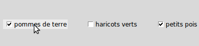

.. _COCHER:

**********************************
Les cases à cocher ``Checkbutton``
**********************************

Les cases à cocher (parfois appelé «checkbox») permettent à l'utilisateur d'effectuer des choix. L'illustration ci-dessous montre trois cases à cocher dont deux sont cochées (état "on": 1) et une est décochée (état "off": 0).

L'indicateur est la partie de la case à cocher qui indique son état, et l'étiquette est le texte qui apparaît à côté.

* Vous aurez besoin de créer une variable de contrôle de classe ``IntVar`` afin que votre programme puisse interroger et/ou définir l'état de la case à cocher. Voir la section 52, «Les variables de contrôle: les valeurs derrière les widgets".

* Vous pouvez également utiliser des liaisons d'événements pour réagir aux actions de l'utilisateur sur la case à cocher, voir la section 54, «Événements».

* Vous pouvez désactiver une case à cocher. Cela modifie son apparence (qui est alors "grisé") et la rend insensible à la souris.

* Vous pouvez supprimer l'indicateur de case à cocher en utilisant l'option **indicatoron**. Le widget ressemble alors à un bouton «poussoir» qui paraît enfoncé quand il est activé, et soulevé quand il est désactivé.

Pour créer une case à cocher dans une fenêtre ou un cadre nommé ``parent``:

.. py:class:: Checkbutton(parent, option, ...)

        Le constructeur renvoie un nouveau widget Checkbutton. Les options incluent:

        :arg activebackground: 
                La couleur de fond lorsque la case à cocher est sous le curseur. Voir la section 5.3, "Les couleurs".
        :arg activeforeground: 
                La couleur du premier plan lorsque la case à cocher est sous le curseur.
        :arg anchor:
                Si le widget se situe dans un espace plus grand que nécessaire, cette option spécifie où la case à cocher va se placer dans cet espace. La valeur par défaut est ``anchor='center'``. Voir la section 5.5, "Le système d'ancrage" pour les valeurs permises. Par exemple, si vous utilisez anchor=NW, le widget sera placé dans le coin supérieur gauche de l'espace.
        :arg bg: or background
                La couleur de fond normale s'affiche derrière l'étiquette et indicateur. Voir la section 5.3, "Les couleurs". Pour l'option bitmap, ceci spécifie la couleur affichée pour le bit 0 dans le bitmap.
        :arg bitmap:
                Pour afficher une image monochrome sur un bouton, affectez un bitmap à cette option; voir :ref:`bitmaps`.
        :arg bd: or borderwidth
                La taille de la bordure autour de l'indicateur. Elle est par défaut de deux pixels. Pour les valeurs possibles, voir :ref:`bitmaps`.
        :arg command:
                Pour appeler une procédure à chaque fois que l'utilisateur change l'état de cette case à cocher.
        :arg compound: 
                Utilisez cette option pour afficher le texte et un graphique, qui peut être un bitmap ou une image, sur le bouton. Les valeurs autorisées décrivent la position du graphique par rapport au texte, et peuvent être l'une des suivantes : ``'bottom'``, ``'top'``, ``'left'``, ``'right'``, ou ``'center'``. Par exemple, ``compound='left'`` positionnerait le graphique à gauche du texte.
        :arg cursor:
                Si vous définissez cette option par un nom de curseur (voir :ref:`pointeurs`),
                le curseur de la souris se transforme en ce modèle quand il est sur la case à cocher.
        :arg disabledforeground:
                La couleur de premier plan utilisée pour afficher le texte d'une case à cocher désactivée. La valeur par défaut est une version pointillée de la couleur de premier plan par défaut.
        :arg font:
                La police utilisée pour le texte. Voir la section 5.4, "Les polices de caractères".
        :arg fg: or foreground
                La couleur utilisée pour afficher le texte. Pour l'option bitmap, ceci spécifie la couleur affichée pour le bit 1 dans le bitmap.
        :arg height:
                Le nombre de lignes de texte sur la case à cocher. La valeur par défaut est 1.
        :arg highlightbackground:
                Couleur de la ligne de mise en valeur du focus quand le widget l'a perdu. Voir “Focus: routing keyboard input”.
        :arg highlightcolor:
                Couleur de la ligne de mise en valeur du focus quand le widget l'a obtenu.
        :arg highlightthickness:
                Épaisseur de la ligne de mise en valeur du focus.
        :arg image:
                Pour afficher une image graphique sur le bouton, affectez une image à cette option. Voir la section 5.9, "Les images".
        :arg indicatoron:
                Normalement, l'indicateur de la case à cocher indique si la case à cocher est activée ou pas. Vous pouvez obtenir ce comportement en définissant ``indicatoron=1``. Toutefois, si vous définissez ``indicatoron=0``, l'indicateur disparaît et le widget entier devient un bouton push-push qui paraît enfoncé quand il est activé, et soulevé quand il est désactivé. Vous pouvez augmenter la valeur **borderwidth** pour rendre plus facile la lecture de l'état d'un tel contrôle.
        :arg justify:
                Si le texte contient plusieurs lignes, cette option contrôle la manière dont le texte est justifié: ``'center'``, ``'left'``, ou ``'right'``.
        :arg offrelief: 
                Par défaut, les cases à cocher utilisent le style de relief ``'raised'`` lorsque le bouton est désactivé (autorisé); utiliser cette option pour spécifier un style différent de relief à afficher lorsque le bouton est éteint. Voir "Les styles de relief" pour les valeurs.
        :arg offvalue:
                Normalement, la variable de contrôle associée à une case à cocher sera mise à 0 quand cette case est désactivée (OFF). Vous pouvez fournir une autre valeur pour cette état OFF en affectant cette valeur à offvalue.
        :arg onvalue:
                Normalement, la variable de contrôle associée à une case à cocher sera mise à 1 quand cette case est activée (ON). Vous pouvez fournir une autre valeur pour cette état ON en affectant cette valeur à offvalue.
        :arg overrelief: 
                Utilisez cette option pour spécifier un style de relief à afficher lorsque la souris est sur la case à cocher; voir :ref:`reliefs`.
        :arg padx:
                Combien d'espace à laisser à gauche et à droite de la case à cocher et du texte. La valeur par défaut est de 1 pixel. Pour les valeurs possibles, voir :ref:`dimensions`.
        :arg pady:
                Combien d'espace à laisser au-dessus et en dessous de la case à cocher et du texte. La valeur par défaut est de 1 pixel.
        :arg relief:
                Avec la valeur par défaut, ``relief='flat'``, la case à cocher ne se distingue pas de son arrière-plan. Vous pouvez configurer cette option pour l'un des autres styles (voir :ref:`reliefs`), ou utiliser ``relief='solid'``, ce qui vous donne un cadre noir fixe autour de lui.
        :arg selectcolor:
                La couleur utilisée pour indiquer que la case à cocher est activée. Sa valeur par défaut est ``selectcolor='red'``.
        :arg selectimage:
                Si vous indiquez une image, elle apparaîtra lorsque la case est cochée. Voir “Images”.
        :arg state:
                La valeur par défaut est ``state='normal'``, mais vous pouvez utiliser ``state='disabled'`` pour griser le composant et le rendre inactif. Si la souris se trouve sur la case à cocher, son état est ``'active'``.
        :arg takefocus:
                Par défaut, une case à cocher est visitée par le focus (voir “Focus: routing keyboard input”). Si vous mettez cette option à 0, la case n'est plus visitée par le focus.
        :arg text:
                L'étiquette affichée après la case à cocher. Utiliser le caractère retour chariot ``'\n'`` pour afficher plusieurs lignes de texte.
        :arg textvariable:
                Si vous avez besoin de modifier l'étiquette de la case à cocher pendant l'exécution du programme, créez une variable de contrôle ``StringVar`` (voir “Control variables: the values behind the widgets”) pour gérer sa valeur courante, et affectez cette variable de contrôle à l'option. À chaque fois que le texte de cette variable est modifié, l'étiquette du bouton est mise à jour.
        :arg underline:
                Aver la valeur par défaut, -1, aucun caractère de l'étiquette n'est souligné. Indiquez la position d'un caractère de l'étiquette pour le souligner.
        :arg variable:
                La variable de contrôle qui suit l'état de la case à cocher. Voir “Control variables: the values behind the widgets”. Normalement cette variable est un ``IntVar``, et 0 indique que la case est désactivée, 1 qu'elle est activée, mais voir les options **offvalue** et **onvalue** ci-dessus.
        :arg width:
                La largeur par défaut d'une case à cocher est déterminée par la taille du texte ou de l'image affichée. Vous pouvez régler cette option avec un nombre de caractères afin de réserver la place nécessaire à leur affichage.
        :arg wraplength:
                Normalement, les lignes ne sont pas coupées automatiquement. Configurez cette option avec un certain nombre de caractères afin que les lignes soient ajustées conformément.

        Les cases à cocher incluent les méthodes suivantes:

        .. py:method:: deselect()

                Décoche la case à cocher (off). 

        .. py:method:: flash()

                Fait clignoter la case à cocher quelques fois (entre les couleurs des états ``'active'`` et ``'normal'``). Elle retrouve son état initial après le clignotement.

        .. py:method:: invoke()

                Utilisez cette méthode si vous souhaitez réaliser la même action que celle qui consiste à cliquer sur la case pour changer son état.

        .. py:method:: select()

                Coche la case à cocher (on).

        .. py:method:: toggle()

                Coche ou décoche la case à cocher selon son état courant.
