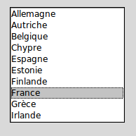

.. _LISTBOX:

*********************************
``Listbox`` - Listes de sélection
*********************************

Un widget ``ListBox`` - liste de sélection - sert à présenter une liste de lignes de textes dans un cadre. Généralement, il s'agit de permettre à l'utilisateur de sélectionner une ou plusieurs lignes dans la liste. Toutes les lignes utilisent la même police de caractère. Si vous avez besoin de quelquechose qui ressemble plus à un éditeur de texte, reportez vous à :ref:`TEXT`.

Pour créer un widget ``Listbox`` à l'intérieur d'une fenêtre mère ou d'un cadre désigné par ``parent``:

.. py:class:: Listbox(parent, option, ...)

        Ce constructeur retourne la nouvelle liste de sélection créée. Ses options incluent:

        :arg activestyle:
                Cette option sert à préciser l'apparence de la ligne active. Elle peut prendre l'une de ces valeurs: ``'underline'`` - la ligne active est souslignée (valeur par défaut) ; ``'dotbox'`` - La ligne active est mise en valeur par une ligne pointillée ; ``'none'`` - aucune mise en valeur.
        :arg bg: 
                (ou **background**) La couleur de fond de la liste de sélection.
        :arg bd: 
                (ou **borderwidth**) La largeur de la bordure de la liste de sélection. 2 pixels par défaut. Pour les valeurs possibles, voir :ref:`dimensions`.
        :arg cursor: 
                La cursor utilisée lorsque la souris survole le widget. Voir :ref:`pointeurs`.
        :arg disabledforeground: 
                La couleur du texte lorsque l'état du widget est ``'disabled'``.
        :arg exportselection: 
                Par défaut, l'utilisateur peut sélectionner le texte à la souris qui est alors copier dans le presse-papier. Pour désactiver ce comportement, utiliser ``exportselection=0``.
        :arg font: 
                La police de caractère utilisée pour le texte de la liste de sélection. Voir :ref:`polices`.
        :arg fg: 
                (ou **foreground**) La couleur utilisée pour le texte. Voir :ref:`couleurs`.
        :arg height: 
                Nombre de lignes (pas en pixels!) montrées dans la liste de sélection. 10 par défaut.
        :arg highlightbackground: 
                Couleur de la ligne de focus lorsque le widget ne l'a pas. Voir :ref:`FOCUS`.
        :arg highlightcolor: 
                Couleur de la ligne de focus lorsque le widget l'obtient.
        :arg highlightthickness: 
                Épaisseur de la ligne de focus.
        :arg listvariable:
                Une ``StringVar`` qui est associée à la liste de sélection dans son ensemble (Voir :ref:`CTRLVARIABLES`). L'appel de la méthode ``get()`` de cette variable de contrôle retourne une chaîne de la forme ``"('t0', 't1', ...)"`` où chaque ti est le contenu d'une ligne de la boîte de sélection. Pour modifier toutes les lignes de la boîte, appelez la méthode ``set(s)`` sur la variable de contrôle, où s est une chaîne qui contient les valeurs de chaque ligne séparées avec des espaces. Par exemple, si ``listCon`` est une ``StringVar`` associé à l'option **listvariable** d'une boîte de sélection, l'appel ``listCon.set('un deux trois')`` remplira la boîte avec trois lignes et l'appel ``listCon.get()`` retournera ``"('un', 'deux', 'trois')"``.
        :arg relief: 
                Sert à régler le relief de la bordure. ``'sunken'`` par défaut. Pour d'autres valeurs, voir :ref:`reliefs`.
        :arg selectbackground: 
                La couleur de fond utilisée pour les lignes sélectionnées.
        :arg selectborderwidth: 
                L'épaisseur de la bordure des lignes de texte sélectionnées. 0 par défaut. Elle est utilisée pour produire un effet de relief ``'raised'`` plus ou moins fort autour du texte sélectionné (Voir :ref:`reliefs`).
        :arg selectforeground: 
                La couleur du texte sélectionné.
        :arg selectmode:
                Détermine le nombre d'items qu'il est possible de sélectionner et la gestion du cliquer-glisser sur la sélection. ``'browse'`` -  Valeur par défaut, le cliquer-glisser modifie la sélection. ``'single'`` - Une seule ligne peut être sélectionnée et il n'est pas possible de déplacer la sélection par cliquer-glisser. ``'multiple'`` - Vous pouvez sélectionner plusieurs lignes à la fois. Le fait de cliquer sur une ligne déjà sélectionnée la déselectionne et vice versa. ``'extended'`` - vous pouvez sélectionner des lignes adjacentes par cliquer-glisser. 
        :arg state:
                Par défaut, une liste de sélection est dans l'état ``'normal'``. Pour désactiver la liste relativement à la souris, mettre la valeur ``'disabled'``.
        :arg takefocus: 
                Ce widget obtient le focus normalement. Mettre 0 pour sortir ce widget de la liste de «traversée du focus». Voir :ref:`FOCUS`.
        :arg width: 
                La largeur du widget mesurée en caractères (non en pixels). La largeur effective est basée sur la largeur moyenne des caractères de la fonte utilisée. 20 par défaut.
        :arg xscrollcommand: 
                Si vous souhaitez que l'utilisateur puisse faire défiler la liste horizontalement, vous pouvez lier votre liste de sélection à une barre de défilement horizontale. Configurer cette option avec la méthode ``set()`` de la barre de défilement. Voir :ref:`defilsellist` pour plus d'informations.
        :arg yscrollcommand: 
                Similaire à l'option précédente mais pour un défilement vertical.

        Les méthodes des listes de sélection utilisent fréquement des index:

        * Si vous utilisez un entier comme index, il se rapporte à la ligne de la liste de sélection qui possède cet index, en comptant à partir de 0.

        * L'index ``'end'`` correspond à la dernière ligne de la liste de sélection.

        * L'index ``'active'`` correspond à la ligne sélectionnée. Si la liste de sélection permet la multisélection, il correspond à la dernière ligne sélectionnée.

        * Un index de la forme ``'@x,y'`` correspond à la ligne qui est la plus proche du point de coordonnées (x,y) relativement au coin supérieur gauche du widget.

        Les méthodes des listes de sélection incluent:

        .. hlist::
                :columns: 4

                * :py:meth:`activate`
                * :py:meth:`bbox`
                * :py:meth:`curselection`
                * :py:meth:`delete`
                * :py:meth:`get`
                * :py:meth:`index`
                * :py:meth:`insert`
                * :py:meth:`itemcget`
                * :py:meth:`itemconfig`
                * :py:meth:`nearest`
                * :py:meth:`scan_dragto`
                * :py:meth:`scan_mark`
                * :py:meth:`see`
                * :py:meth:`selection_anchor`
                * :py:meth:`selection_clear`
                * :py:meth:`selection_includes`
                * :py:meth:`selection_set`
                * :py:meth:`size`
                * :py:meth:`xview`
                * :py:meth:`xview_moveto`
                * :py:meth:`xview_scroll`
                * :py:meth:`yview`
                * :py:meth:`yview_moveto`
                * :py:meth:`yview_scroll`

        .. py:method:: activate(index)

                Sélectionne la ligne ayant l'*index* indiqué.

        .. py:method:: bbox(index)

                Retourne la boîte englobante - *bounding box* - de la ligne ayant l'*index* indiqué sous la forme d'un tuple à 4 éléments ``(x, y, largeur, hauteur)``, où le pixel le plus en haut et à gauche de cette ligne est situé en ``(x,y)`` et la *largeur* et *hauteur* sont données en pixels. La *largeur* correspond à la partie de la ligne qui contient le texte.

                Si la ligne de numéro *index* n'est pas visible, cette méthode retourne ``None``. Si elle est partiellement visible, la boîte englobante peut excéder la zone visible.

        .. py:method:: curselection()

                Retourne un tuple qui contient les numéros ou index de la ou des lignes sélectionnées, en comptant à partir de 0. Si aucune ligne n'est sélectionnée, le tuple est vide.

        .. py:method:: delete(debut, fin=None)

                Supprime les lignes dont les indices sont dans l'intervalle [*debut*, *fin*] (extrémités incluses). Si le deuxième argument est omis, seule la ligne d'index *debut* est supprimée.

        .. py:method:: get(debut, fin=None)

                Retourne un tuple qui contient les textes des lignes dont les indices appartiennent à l'intervalle [*deb*, *fin*]. Si le deuxième argument est omis, seul le texte de la ligne d'indice *debut* est retourné.

        .. py:method:: index(i)

                Si c'est possible, positionne la partie visible de la liste de sélection de telle sorte qui la ligne numéro *i* soit tout en haut de la liste.

        .. py:method:: insert(index, *elements)

                Insert une ou plusieurs lignes (autant que d'*éléments* fournis après le premier argument) dans la liste avant la ligne de numéro *index*. Utiliser ``'end'`` comme premier argument si vous souhaitez ajouter de nouvelles lignes à la fin de la liste.

        .. py:method:: itemcget(index, option)

                Retourne l'une des valeurs d'option de la ligne de numéro *index* de la liste. Pour les options possibles, voir la méthode ``itemconfig()`` ci-dessous. Si l'option donnée n'a pas été configurée pour la ligne indiquée, la valeur de retour est une chaîne vide.

        .. py:method:: itemconfig(index, option=value, ...)

                Modifie une ou des options de configuration de la ligne de numéro *index*. Les options incluent:

                :arg background:
                        La couleur de fond de la ligne.
                :arg foreground:
                        La couleur du texte de la ligne.
                :arg selectbackground:
                        La couleur de fond utilisée lorsque la ligne est sélectionnée.
                :arg selectforeground:
                        La couleur du texte utilisée lorsque la ligne est sélectionnée.

        .. py:method:: nearest(y)

                Retourne l'index de la ligne visible la plus proche du niveau *y* (vertical) exprimé en pixels relativement au bord supérieur du widget.

        .. py:method:: scan_dragto(x, y)

                Voir la méthode ``scan_mark()`` ci-dessous. 

        .. py:method:: scan_mark(x, y)

                Utilisez cette méthode pour implémenter le défilement rapide de la liste de sélection à la souris. Pour réaliser cette fonctionnalité, lier un événement «appui sur l'un des boutons de la souris» à un gestionnaire qui se chargera d'appeler la méthode ``scan_mark()`` à la position courante de la souris. Ensuite, lier l'événement «déplacement de la souris» (*Motion*) à un gestionnaire qui appelera ``scan_dragto()`` avec la position courante de la souris. La liste de sélection défilera alors à un rythme proportionnel à la distance qui sépare la position enregisrée par ``scan_mark`` et la position courante.

        .. py:method:: see(index)

                Ajuste la position de la liste de sélection de telle sorte que la ligne de numéro *index* soit visible.

        .. py:method:: selection_anchor(index)

                Positionne l'«ancre de sélection» sur la ligne de numéro *index*. Une fois que cette ancre a été positionnée, vous pouvez y faire référence en utilisant l'index spécial ``'anchor'``.

                Par exemple, si votre liste est ``lbox``, ces instructions sélectionnerons les lignes 3, 4 et 5:

                ::

                        lbox.selection_anchor(3)
                        lbox.selection_set(tk.ANCHOR,5)

        .. py:method:: selection_clear(debut, fin=None)

                Déselectionne toutes les lignes dont les index appartiennent à l'intervalle [*debut*, *fin*]. Si le second argument est omis, seule la ligne de numéro *debut* est déselectionnée.

        .. py:method:: selection_includes(index)

                Retourne 1 si la ligne d'index donné est sélectionnée et retourne 0 autrement.

        .. py:method:: selection_set(debut, fin=None)

                Sélectionne toute les lignes dont les index appartiennent à l'intervalle [*debut*, *fin*]. Si le deuxième argument est omis, seule la ligne d'index *debut* est sélectionnée.

        .. py:method:: size()

                Retourne le nombre de lignes de la liste de sélection.

        .. py:method:: xview()

                Pour faire défiler la liste horizontalement, configurez l'option *command* du widget barre de défilement horizontale avec cette méthode. Voir :ref:`defilsellist`.

        .. py:method:: xview_moveto(fraction)

                Fait défiler la liste de sélection horizontalement de telle sorte que le côté gauche de la *fraction* de sa ligne la plus longue soit placé contre le bord gauche de la zone visible. L'argument *fraction* appartient à l'intervalle [0,1].

        .. py:method:: xview_scroll(nombre, quoi)

                Fait défiler la liste de sélection horizontalement. Pour l'argument *quoi*, utiliser soit ``'units'`` pour un défilement d'unité «un caractère», ou ``'pages'`` pour un défilement où l'unité est la «largeur effective de la liste de sélection». L'argument *nombre* indique le nombre d'unités du défilement: les valeurs négatives font défiler vers la droite, les positives vers la gauche.

        .. py:method:: yview()

                Similaire à la méthode ``xview()``, mais pour un défilement vertical.

        .. py:method:: yview_moveto(fraction)

                Similaire à la méthode ``xview_moveto()`` pour un défilement vertical.

        .. py:method:: yview_scroll(nombre, quoi)

                Similaire à la méthode ``xview_scroll()`` mais pour un défilement vertical. ``'units'`` se réfère à l'unité «ligne» et ``'pages'`` à l'unité «hauteur visible de la liste».

.. _defilsellist:

Défilement d'une liste de sélection
===================================

Voici un fragment de code qui illustre la création et la liaison d'une liste de sélection avec des barres de défilement verticale et horizontale::

    yDefilB = Scrollbar(root, orient='vertical')
    yDefilB.grid(row=0, column=1, sticky='ns')

    xDefilB = Scrollbar(root, orient='horizontal')
    xDefilB.grid(row=1, column=0, sticky='ew')

    listSel = Listbox(root,
         xscrollcommand=xDefilB.set,
         yscrollcommand=yDefilB.set)
    listSel.grid(row=0, column=0, sticky='nsew')
    xDefilB['command'] = listSel.xview
    yDefilB['command'] = listSel.yview

