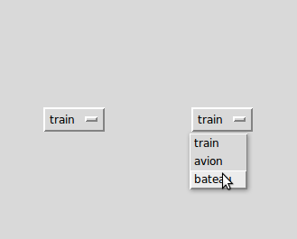

.. _OPTIONMENU:

************************************
``OptionMenu`` - Les menus d'options 
************************************

Le but de ce widget est d'offrir un ensemble fixe de choix à l'utilisateur dans un menu déroulant.

L'illustration ci-dessus montre un menu d'options, ``OptionMenu``, dans deux états. L'exemple de gauche montre le widget dans sa forme initiale. L'exemple de droite montre à quoi il ressemble lorsqu'on a cliqué dessus avec la souris et qu'on a choisi 'bateau'.

Pour créer un nouveau widget ``OptionMenu`` en tant qu'enfant d'une fenêtre ou d'un cadre nommé ``parent``:

.. py:class:: OptionMenu(parent, variable, choix1, choix2, ...)

        Ce constructeur renvoie le nouveau widget ``OptionMenu``. La variable est une instance de la classe ``StringVar`` (voir :ref:`CTRLVARIABLES`) qui est associée au widget, et les arguments restants sont les choix à afficher dans le widget sous forme de chaînes.

L'illustration ci-dessus a été créée avec cet extrait de code
        
.. code-block:: python

        listeOptions = ('train', 'avion', 'bateau')
        v = StringVar()
        v.set(listeOptions[0])
        om = OptionMenu(root, v, *listeOptions)

Pour savoir quel choix est sélectionné dans un widget ``OptionMenu``, la méthode ``get()`` sur la variable de contrôle associée retournera ce choix comme une chaîne.
