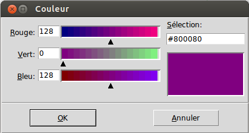

.. _DIALOGS:

*********************
Fenêtres de dialogues
*********************

Tkinter fournit trois sous-modules qui servent à créer des fenêtres de «dialogue» préfonconfigurées. Ces fenêtres sont utiles pour transmettre une information à l'utilisateur ou pour lui demander quelque chose. Ces sont des fenêtres popups ou «surgissantes» car leur durée de vie est limitée: elles sont détruites dès que l'utilisateur clique sur un bouton de validation.

* ``tkinter.messagebox``: fournit un assortiment de fenêtres de dialogue pour des tâches simples.

* ``tkinter.filedialog``: fournit un navigateur de fichiers.

* ``tkinter.colorchooser``: fournit une fenêtre qui sert à sélectionner une couleur.

Pour utiliser un sous-module, il faut l'importer. Par exemple, si votre application propose d'ouvrir un fichier, vous utiliserez sans doute une fenêtre de navigation du sous-module *tkinter.filedialog*. L'entête de votre programme ressemblera alors à::

        from tkinter import * 
        from tkinter.filedialog import *
        ...
    
Le sous-module ``messagebox``
=============================

Après avoir importé le sous-module ``messagebox``, vous pouvez créer simplement huit sortes de fenêtres popups en appelant les fonctions données ci-après.

.. list-table::
   :widths: 50 50
   :header-rows: 0

   * - .. image:: img/dialog/askokcancel.png 
     - .. py:function:: askokcancel(titre, message, option=valeur, ...)
   * - .. image:: img/dialog/askquestion.png
     - .. py:function:: askquestion(titre, message, option=valeur, ...)
   * - .. image:: img/dialog/askretrycancel.png
     - .. py:function:: askretrycancel(titre, message, option=valeur, ...)
   * - .. image:: img/dialog/askyesno.png
     - .. py:function:: askyesno(titre, message, option=valeur, ...)
   * - .. image:: img/dialog/askyesnocancel.png
     - .. py:function:: askyesnocancel(titre, message, option=valeur, ...)
   * - .. image:: img/dialog/showerror.png
     - .. py:function:: showerror(titre, message, option=valeur, ...)
   * - .. image:: img/dialog/showinfo.png
     - .. py:function:: showinfo(titre, message, option=valeur, ...)
   * - .. image:: img/dialog/showwarning.png
     - .. py:function:: showwarning(titre, message, option=valeur, ...)

Dans chaque cas, l'argument *titre* permet de donner un titre à la fenêtre et l'argument *message* est une chaîne qui sera affichée dans le corps de la fenêtre; vous pouvez y insérer des sauts de ligne en utilisant le caractère spécial ``'\n'``.

Les options sont:

        **default**

                Sert à indiquer le bouton qui représente le choix par défaut. Si vous ne précisez pas cette option, c'est le bouton le plus à gauche qui est choisi.

                Pour préciser un bouton par défaut, utilisez l'une des valeurs ``'cancel'``, ``'ignore'``, ``'ok'``, ``'no'``, ``'retry'`` ou ``'yes'``.

        **icon**

                Sert à sélectionner l'icône affichée sur la fenêtre de dialogue. Les valeurs possibles sont ``'error'``, ``'info'``, ``'question'`` ou ``'warning'``.

        **parent**

                Si vous ne configurez pas cette option, la fenêtre surgissante apparaîtra au-dessus de votre fenêtre principale. Pour la faire apparaître au-dessus d'une fenêtre arbitraire ``w``, utilisez ``parent=w``.

Chacune des fonctions ``ask...`` retourne une valeur qui dépend du bouton sur lequel l'utilisateur a cliqué afin de mettre fin au «dialogue». 

* ``askokcancel``, ``askretrycancel``, et ``askyesno`` retournent toutes un booléen: ``True`` si l'utilisateur a cliqué sur le bouton "Ok", "Oui" ou "Ré-essayer", ``False`` s'il a cliqué sur "Non" ou sur "Annuler".

* ``askyesnocancel`` retourne ``True``, ``False``, ou ``None`` selon que l'utilisateur a cliqué sur le bouton "Oui", "Non" ou "Annuler".

* ``askquestion`` retourne une chaîne ``'yes'`` pour "Oui", ou ``'no'`` pour "Non".
    
Le sous-module ``filedialog``
=============================

Le sous-module ``filedialog`` fournit des fonctions qui servent à créer des fenêtres popups pour permettre à l'utilisateur de choisir un fichier. Une fois que l'utilisateur a fait son choix, la fonction retourne le chemin complet du fichier. Voici à quoi ressemble une telle fenêtre:

.. image:: img/dialog/asksaveasfilename.png
        :align: center

Les fonctions disponibles sont:

   .. py:function:: askopenfilename(option=valeur, ...)

           Produit une fenêtre popup qui permet à l'utilisateur de sélectionner un fichier existant. Cela fait, la fonction retourne le chemin complet du fichier (dans l'arborescence) sous la forme d'une chaîne (vide si l'utilisateur a appuyé sur "annuler").
   
           Si l'utilisateur sélectionne un fichier qui n'existe pas, une nouvelle popup apparaîtra pour lui indiquer ce fait.

   .. py:function:: asksaveasfilename(option=valeur, ...)

           Produit une fenêtre popup qui permet à l'utilisateur de sélectionner un répertoire et d'indiquer le nom d'un fichier qu'il souhaite créer ou qu'il souhaite remplacer s'il existe déjà. Dans ce dernier cas, une popup apparaît pour le mettre en garde sur le fait que le fichier existe déjà et pour lui demander si il souhaite vraiment le remplacer. i
           
           La fonction retourne le chemin complet du fichier à créer ou à remplacer sous la forme d'une chaîne (éventuellement vide).

Les options des deux fonctions sont les mêmes:

        **defaultextension**

                L'extension du fichier par défaut, c'est à une chaîne qui commence par un point «.». Si l'utilisateur utilise un point dans le nom de fichier, cette option n'a pas d'effet. Autrement, l'extension donnée est concaténée au nom de fichier fourni par l'utilisateur.

                Par exemple, si vous utilisez ``defaultextension='.jpg'`` et que l'utilisateur saisi ``'gojiro'``, le nom de fichier utilisé sera au final ``'gojiro.jpg'``.

        **filetypes**

                Une liste de la forme ``[(nom1, motif1), (nom2, motif2), ...]`` dont les éléments sont des 2-tuples qui contiennent, d'une part le nom d'un type de fichiers, d'autre part un motif de sélection qui servira à filtrer les fichiers selon que leur nom corresponde ou non au motif. Le nom est affiché sur le bouton de sélection «Type de fichiers» afin d'aider l'utilisateur à comprendre quels sont les fichiers filtrés.
               
                Par exemple, pour permettre à l'utilisateur d'afficher uniquement les fichiers dont le nom se termine par ``'.png'``, vous pourriez utiliser ``filetypes=[("PNG","*.png")]``. Le caractère ``*`` est une sorte de joker qui symbolise tous les caractères situés avant le point. 
               
                En précisant plus de tuples de ce genre dans la liste, on donne à l'utilisateur le choix du filtre qu'il peut sélectionner en utilisant le bouton «Type de fichiers» (voir l'illustration).

        **initialdir**

                Le chemin du dossier dont il faut afficher le contenu initialement. Le dossier par défaut est le dossier de travail actuel (probablement celui qui contient le fichier de votre programme).

        **initialfile**

                Le nom de fichier à afficher initialement dans le champ "Nom de fichier:".

        **parent**

                Pour faire en sorte que la fenêtre popup apparaîsse au-dessus d'une fenêtre ``w`` , utilisez ``parent=w``. Par défaut, la fenêtre popup apparaît au-dessus de la fenêtre principale de votre application.

        **title**

                Sert à donner un titre explicite à la fenêtre popup.

Le sous-module ``colorchooser``
===============================

Pour fournir à l'utilisateur de votre application un moyen simple de sélectionner une couleur, importez le sous-module ``colorchooser`` et appelez cette fonction:

.. code-block:: python

        couleur = askcolor(couleur, option=valeur, ...)

L'argument *couleur* sert à préciser la couleur sélectionnée par défaut au moment où la fenêtre popup s'ouvre. C'est un gris léger par défaut.

Les options sont:

        **title**

                Le titre de la fenêtre. "Couleur" par défaut.

        **parent**

                Pour faire apparaître la popup au-dessus d'une fenêtre ``w``, utiliser ``parent=w``. Le comportement par défaut est de la faire apparaître au-dessus de la fenêtre principale du programme.

Si l'utilisateur clique sur le bouton "Ok" de la popup, la valeur de retour est un tuple de la forme ``(triple, couleur)``. Le nom ``triple`` représente un tuple ``(R, V, B)`` qui contient les composantes Rouge, Vert et Bleu de la couleur sélectionnée; chaque composante est un entier de l'intervalle [0,255]. Enfin, le nom ``couleur`` représente une chaîne qui contient le code hexadécimal ``'#RRVVBB'`` de la couleur choisie.

Si l'utilisateur clique sur "Annuler", la fonction retourne ``(None, None)``.
