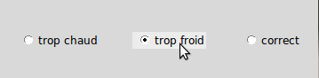
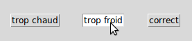

.. _RADIOBUTTON:

***********************************
``Radiobutton`` - Boutons radio 
***********************************

Les boutons radio servent à réaliser des ensembles de widgets connexes qui permettent à l'utilisateur de sélectionner un choix (et un seul) parmi d'autres; chaque bouton radio représente un choix possible et se compose de deux parties, l'indicateur et l'étiquette:

Voici un extrait du code qui a servit à produire l'illustration::

        vals = ['A', 'B', 'C']
        etiqs = ['trop chaud', 'trop froid', 'correct']
        varGr = StringVar()
        varGr.set(vals[1])
        for i in range(3):
            b = RadioButton(root, variable=varGr, text=etiqs[i], value=vals[i])
            b.pack(side='left', expand=1)

* L'indicateur est la partie en forme de cercle ou de losange qui indique à l'utilisateur si le bouton est sélectionné ou non.

* L'étiquette est le texte affiché à côté de l'indicateur. Vous pouvez aussi utiliser un bitmap ou une image en guise d'étiquette.

* Si vous préférez, vous pouvez vous supprimez l'indicateur. Les boutons radio ressemblent alors à des boutons «poussoirs» (deuxième illustration): celui qui est sélectionné semble enfoncé et les autres semblent soulevés.

* Pour réunir plusieurs boutons radio dans un groupe fonctionnel, créez une variable de contrôle unique (voir :ref:`RADIOBUTTON`), et réglez l'option **variable** de chaque bouton radio du groupe avec cette variable.

* La variable de contrôle peut être soit un ``IntVar``, soit un ``StringVar``. Si deux ou plusieurs boutons radio partagent la même variable de contrôle, l'activation de l'un entraînera la désactivation des autres.

* Chaque bouton radio d'un groupe doit être configuré avec une valeur qui lui est propre et qui est du même type que celle de la variable de contrôle partagée. Pour configurer cette valeur, utiliser l'option **value** de chaque bouton. Par exemple, un groupe de trois boutons radio pourrait partager un ``IntVar``, chaque bouton ayant sont option **value** configurée avec l'une des valeur 0, 1 et 99. Ou, vous pouvez utiliser une variable de contrôle ``StringVar`` et donner aux boutons radio des valeurs comme 'A', 'B' et 'C'.

Pour créer un nouveau widget bouton radio en tant qu'enfant d'une fenêtre ou d'un cadre nommé ``parent``:

.. py:class:: Radiobutton(parent, option, ...)

        Ce constructeur renvoie le nouveau widget Radiobutton. Les options sont:

        :arg activebackground:
                La couleur d'arrière plan utilisé quand la souris est au-dessus du widget. Voir :ref:`couleurs`.
        :arg activeforeground:
                La couleur du texte lorsque la souris est au-dessus du widget.
        :arg anchor:
                Si le widget occupe plus de place que de besoin, cette option sert à préciser la position occupé par le bouton dans cet espace. La valeur par défaut est 'center'. Pour d'autres positions, reportez-vous :ref:`ancrage`. Par exemple, si ``anchor="ne"``, le bouton sera positionné au nord-est, c'est à dire dans le coin supérieur droit.
        :arg bg: 
                (ou **background**) La couleur d'arrière plan du widget.
        :arg bitmap:
                Pour afficher une image monochrome à côté du bouton radio, configurer cette option avec un bitmap; voir :ref:`bitmaps`.
        :arg bd: 
                (ou **borderwidth**) L'épaisseur de la bordure de l'indicateur (c'est à dire du bouton lui-même). 2 pixels par défaut. Pour connaître les valeurs possibles, voir :ref:`dimensions`.
        :arg command:
                Une fonction qui sera appelée à chaque fois que l'utilisateur modifiera l'état du bouton.
        :arg compound: 
                Si vous souhaitez utiliser à la fois une étiquette et un graphique (soit un bitmap soit une image), cette option vous servira à indiquer la position relative du graphique par rapport à l'étiquette. Les valeurs possibles sont ``'none'`` (valeur par défaut), ``'top'``, ``'bottom'``, ``'left'``, ``'right'`` et ``'center'``. Par exemple, si compound='bottom', le graphique est positionné sous le texte. Si ``compound='none'``, le graphique sera affiché, mais pas l'étiquette.
        :arg cursor:
                Le pointeur de souris à afficher lorsque la souris est au-dessus du bouton radio. Voir :ref:`pointeurs`.
        :arg disabledforeground:
                La couleur du texte lorsque le bouton est dans l'état ``'disabled'``. La valeur par défaut est une version  en "pointillée" de la couleur par défaut de l'option **foreground**.
        :arg font:
                La fonte de caractères utilisée pour le texte. Voir :ref:`polices`.
        :arg fg: 
                (ou **foreground**) La couleur de l'étiquette.
        :arg height:
                Le nombre de ligne (non des pixels) de texte que peut contenir le widget. 1 par défaut.
        :arg highlightbackground:
                La couleur de la ligne de mise en valeur du focus lorsque le widget ne l'a pas. Voir :ref:`FOCUS`.
        :arg highlightcolor:
                La couleur de la ligne de mise en valeur du focus lorsque le widget l'obtient.
        :arg highlightthickness:
                L'épaisseur de la ligne de mise en valeur du focus. 1 par défaut. Mettre cette option à 0 pour supprimer la mise en valeur du focus.
        :arg image:
                Pour afficher une image plutôt que du texte à côté du bouton radio, configurez cette option avec l'objet image désirée. Voir :ref:`images`. L'image apparaît lorsque le bouton radio est désactivé; comparez avec l'option **selectimage** ci-dessous.
        :arg indicatoron:
                Normalement un bouton radio est accompagné d'un indicateur. Si vous configurez cette option avec 0, l'indicateur n'apparaît plus, et le widget se comporte comme un bouton "poussoir": Il semble enfoncé lorsqu'on l'active ou "émergent" sinon. Vous pouvez renforcer cet effet en augmentant la valeur de l'option **borderwidth** ce qui rendra l'état du bouton plus visible.
        :arg justify:
                Si le texte est formé de plusieurs ligne, cette option permet de contrôler l'alignement. Les valeurs possbiles sont: ``'center'`` (par défaut), ``'left'``, ou ``'right'``.
        :arg offrelief:
                Si vous supprimez l'indicateur en utilisant ``indicatoron=False``, cette option sert à préciser le style de relief à appliquer au bouton lorsqu'il est désactivé. La valeur par défaut est ``'raised'``.
        :arg overrelief: 
                Le relief a utiliser lorsque la souris est au-dessus du bouton radio.
        :arg padx:
                Espace supplémentaire à ajouter à gauche et droite du texte et du bouton.
        :arg pady:
                Espace supplémentaire à ajouter en haut et en bas du texte et du bouton. 1 pixel par défaut.
        :arg relief:
                Par défaut, un bouton radio a un style de relief ``'flat'`` ce qui fait qu'il ne ressort pas de ce qui l'entoure. Pour d'autres style de relief, voir :ref:`reliefs`. Vous pouvez utiliser l'option ``relief='solid'`` afin d'afficher un cadre autour.
        :arg selectcolor:
                La couleur du bouton radio lorsqu'il est activé. ``'red'`` par défaut.
        :arg selectimage:
                Si vous utilisez l'option **image** pour afficher un graphique plutôt qu'une étiquette lorsque le bouton n'est pas activé, vous pouvez configurer cette option avec une image différente qui sera affichée lorsque le bouton est activé. Voir :ref:`images`.
        :arg state:
                L'état par défaut est ``'normal'``, mais vous pouvez utiliser la valeur ``'disabled'`` pour griser le bouton et le rendre inactif. Lorsque la souris est au-dessus du bouton, son état devient ``'active'``.
        :arg takefocus:
                Par défaut, ce widget reçoit le focus (voir :ref:`FOCUS`). Si vous utilisez takefocus=0, le bouton radio ne sera plus visité par la traversée du focus.
        :arg text:
                L'étiquette ou texte qui est affiché à côté du bouton radio. Utiliser le caractère spacial ``'\n'`` pour faire un saut de ligne.
        :arg textvariable:
                Si vous avez besoin de modifier dynamiquement (au fil de l'exécution) l'étiquette d'un bouton radio, créez une variable de contrôle de classe ``StringVar`` (voir :ref:`CTRLVARIABLES`) qui servira à gérer la valeur courante de l'étiquette, et configurez cette option avec celle-ci. Lorsque la valeur de la variable de contrôle est modifiée (en utilisant sa méthode ``set``), l'étiquette du bouton radio sera mise à jour dans le même temps.
        :arg underline:
                Avec la valeur par défaut, -1, aucun caractère de l'étiquette n'est souligné. Configurez cette option avec l'index (en comptant à partir de 0) du caractère de l'étiquette pour souligner ce caractère.
        :arg value:
                Lorsque le bouton radio est activé par l'utilisateur, sa variable de contrôle prend la valeur indiquée par cette option. Selon que la variable de contrôle est un ``IntVar`` ou un ``StringVar``, donnez à chaque bouton radio d'un groupe une valeur différente (chaîne ou entière) à l'aide de cette option afin de reconnaître celui qui a été activé.
        :arg variable:
                La variable de contrôle que ce bouton partage avec les autres boutons radio du même groupe; voir :ref:`CTRLVARIABLES`. Vous pouvez utiliser une variable de type ``IntVar`` ou ``StringVar``.
        :arg width:
                La largeur par défaut du widget est déterminée par celle du texte ou de l'image qui lui est associé. Vous pouvez configurez cette option avec un nombre de caractères (non des pixels) et le widget sera dimensionnée de façon à pouvoir afficher sur une ligne un tel nombre de caractères.
        :arg wraplength:
                Normalement, les lignes ne sont pas coupées (enveloppées). Vous pouvez configurez cette option avec un nombre de caractères et les lignes seront coupées de façon que chacune d'elle ne contienne pas plus de caractères.

        Les méthodes disponibles sur les widgets ``Radiobutton`` incluent:

        .. py:method:: deselect()

                    Désactive (éteint) le bouton radio appelant.

        .. py:method:: flash()

                    Fait basculer le bouton quelques fois entre les états ``'active'`` et ``'normal'`` après quoi le bouton revient dans l'état dans lequel il était au départ.

        .. py:method:: invoke()

                    Produit le même effet que lorsque l'utilisateur clique sur le bouton pour changer son état.

        .. py:method:: select()

                    Active (allume) le bouton radio appelant. 
