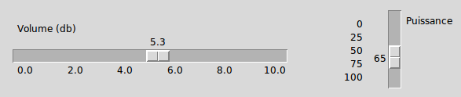

.. _SCALE:

************************
``Scale`` - Échelles
************************

La finalité du widget de type ``Scale`` - ou intervalle de sélection - est de permettre à l'utilisateur de choisir un entier ou un flottant situé à l'intérieur d'un intervalle précis. Voici deux widgets de ce type, l'un orienté horizontalement et l'autre verticalement.

Dans la figure:

* le premier widget ``Scale`` possède le jeu d'options::

        Scale(root, orient='horizontal', from_=0, to=10,
              resolution=0.1, tickinterval=2, length=350,
              label='Volume (db)')

* et le second:: 
  
        Scale(root, orient='vertical', from_=0, to=100,
              resolution=5, tickinterval=25, length=100,
              label='Puissance')

Chaque widget affiche un curseur que l'utilisateur peut déplacer pour modifier la valeur:

* Vous pouvez déplacer le curseur en utilisant le bouton gauche de la souris.

* Si vous cliquez avec le bouton gauche dans la zone de glissement, le curseur est déplacé d'une unité dans la direction du clic. En maintenant le bouton gauche enfoncé, après un délai, ce comportement est répété automatiquement.

* Si le widget ``Scale`` possède le focus, les flèches du clavier peuvent être utilisées pour faire glisser le curseur.

Pour créer un nouveau widget ``Scale`` comme enfant d'une fenêtre ou d'un cadre nommé ``parent``:

.. py:class:: Scale(parent, option, ...)

        Le constructeur retourne le widget ``Scale`` créé. Ses options incluent:

        :arg activebackground: 
                La couleur du curseur lorsque la souris est au-dessus. Voir :ref:`couleurs`.
        :arg bg: 
                 (ou **background**) La couleur d'arrière plan de la partie du widget qui est située en dehors de l'aire de glissement.
        :arg bd: 
                 (ou **borderwidth**) La largeur de la bordure 3d qui forme le contour de l'aire de glissement et du curseur. Sa valeur est 2 pixels par défaut. Pour des valeurs acceptables, voir :ref:`dimensions`.
        :arg command: 
                Une fonction qui sera appelée à chaque fois que le curseur sera déplacé. Cette fonction reçoit un argument qui est la nouvelle valeur sélectionnée dans l'intervalle. Si le curseur est déplacé rapidement, la fonction ne sera pas pour autant appelée pour toutes les positions possibles, mais elle le sera sans aucun doute lorsque le curseur sera positionné.
        :arg cursor: 
                Le pointeur de souris utilisé lorsque la souris est au-dessus du widget. Voir :ref:`pointeurs`.
        :arg digits: 
                Contrôle le nombre de chiffres à utiliser lorsque la valeur sélectionnée est convertie en une chaîne de caractères, ce qui arrive si l'option **variable** décrite plus loin a reçu une variable de contrôle de classe ``StringVar``. Voir :ref:`CTRLVARIABLES`.
        :arg font: 
                La fonte de caractères utilisée pour l'étiquette et les graduations. Voir :ref:`polices`.
        :arg fg:
                (ou **foreground**) La couleur du texte de l'étiquette et des graduations.
        :arg from\_: 
                Un flottant qui définie l'une des extrémités de l'intervalle de sélection. Pour un widget orienté verticalement, c'est celle qui apparaît tout en haut; pour un widget orienté horizontalement, c'est celle qui apparaît tout à gauche. Le caractère de soulignement (_) qui apparaît à la fin de cette option n'est pas une faute de frappe: le mot *from* est un mot clé de Python. Sa valeur par défaut est 0.0. Voir l'option **to** plus loin pour préciser l'autre extrémité de l'intervalle.
        :arg highlightbackground: 
                La couleur de la ligne de mise en valeur du focus lorsque le widget ne l'a pas. Voir :ref:`FOCUS`.
        :arg highlightcolor: 
                La couleur de la ligne de mise en valeur du focus lorsque le widget l'obtient.
        :arg highlightthickness: 
                L'épaisseur de la ligne de mise en valeur du focus. 1 par défaut. Utilisez ``highlightthickness=0`` pour supprimer la mise en valeur du focus.
        :arg label: 
                Vous pouvez afficher une étiquette à l'intérieur de ce widget en réglant cette option avec le texte souhaité. L'étiquette apparaît dans le coin supérieur gauche si le widget est orienté horizontalement et dans le coin supérieur droit s'il est orienté verticalement. Il n'y a pas d'étiquette par défaut.
        :arg length: 
                La longueur du widget dans la direction où celui-ci est orienté. La valeur par défaut est 100 pixels. Pour les valeurs permises, voir :ref:`dimensions`.
        :arg orient: 
                Utilisez ``'horizontal'`` pour l'orienter horizontalement ou ``'vertical'`` pour l'orienter verticalement. L'orientation par défaut est ``'vertical'``.
        :arg relief: 
                Avec la valeur par défaut ``'flat'``, le widget n'a pas de bordure visible. Vous pouvez utiliser la valeur ``'solid'`` pour l'entourer d'un cadre noir, ou utiliser un des autres reliefs fournit pas Tkinter; voir :ref:`reliefs`.
        :arg repeatdelay: 
                Cette option contrôle la durée (en millisecondes) pendant laquelle le bouton gauche de la souris doit être enfoncé (sur la zone de glissement) avant que le curseur ne soit déplacé de manière répétitive dans cette direction. La valeur par défaut est ``repeatdelay=300``.
        :arg repeatinterval: 
                Cette option sert à contrôler l'intervalle de temps entre deux répétitions du déplacement du curseur lorsque l'utilisateur clique en laissant le bouton enfoncé dans l'aire de glissement. Par exemple, ``repeatinterval=100`` signifie que le curseur se déplace toutes les 100 millisecondes (1 dixième de seconde).
        :arg resolution: 
                Sert à modifier l'incrément (écart entre deux valeurs consécutives). Sa valeur par défaut est 1.0. Par exemple, si ``from_=-1.0``, ``to=1.0``, et si ``resolution=0.5``, l'utilisateur pourra obtenir 5 valeurs: -1.0, -0.5, 0.0, +0.5, et +1.0. Utilisez une valeur négative, par exemple ``resolution=-1`` , pour empêcher l'arrondi automatique des valeurs.
        :arg showvalue: 
                Par défaut, la valeur courante du curseur est affichée (au-dessus du curseur s'il est horizontal, à gauche s'il est vertical). Mettre cette option à 0 pour supprimer cet affichage.
        :arg sliderlength: 
                Sert à modifier la longueur du curseur qui vaut 30 pixels par défaut. Voir :ref:`dimensions`.
        :arg sliderrelief: 
                Sert à modifier le relief utilisé pour le curseur. Sa valeur par défaut est ``'raised'``, Voir :ref:`reliefs`.
        :arg state: 
                Sert à preciser l'état du widget: ``'normal'``, ``'active'`` ou ``'disabled'``. Pour empêcher l'utilisateur de modifier sa valeur, utilisez ``'disabled'``.
        :arg takefocus: 
                Normalement, ce widget obtient le focus. Mettre cette option à 0 pour désactiver ce comportement. Voir :ref:`FOCUS`.
        :arg tickinterval: 
                Par défaut, sa valeur est 0 ce qui a pour effet de ne pas afficher de graduation le long de l'intervalle. Pour afficher une telle graduation, réglez cette option avec un flottant qui correspond au pas de la graduation, c'est à dire à l'écart entre deux valeurs successives. Par exemple, si ``from_=0.0``, ``to=1.0``, et ``tickinterval=0.25``, une graduation est affichée avec les valeurs 0.0, 0.25, 0.50, 0.75, et 1.00. Elles apparaissent en dessous de l'intervalle de sélection si l'orientation du widget est horizontale, à sa gauche si l'orientation est verticale.
        :arg to: 
                Un flottant qui indique une extrémité de l'intervalle de sélection des valeurs. L'autre extrémité est définie en utilisant l'option **from\_** présentée plus haut. Cette valeur peut être supérieure ou inférieure à celle de l'option **from_**. Dans tous les cas, elle correspond à l'extrémité droite du widget si il est orienté horizontalement; à son extrémité basse autrement. Sa valeur par défaut est 100.0.
        :arg troughcolor: 
                La couleur de l'aire de glissement du curseur.
        :arg variable: 
                Sert à préciser la variable de contrôle éventuellement associée à ce widget (Voir :ref:`CTRLVARIABLES`). Cette variable peut être de classe ``IntVar``, ``DoubleVar`` (pour les flottants) ou ``StringVar``. Dans le cas d'une ``StringVar``, les valeurs numériques seront converties en chaînes de caractères; voir l'option **digits** ci-dessus pour plus d'information sur cette conversion.
        :arg width: 
                Sert à préciser la largeur de l'aire de glissement du curseur. Si le widget est orienté horizontalement, il s'agit de la dimension en *y*; sinon de sa dimension en *x*. La valeur par défaut est 15 pixels.

        Les intervalles de sélection ou widget ``Scale`` disposent de ces méthodes:

        .. py:method:: coords(valeur=None)

                    Retourne les coordonnées, sous la forme d'un 2-tuple *(x, y)*, qui correspondent à une certaine *valeur* de l'intervalle de sélection relativement au coin supérieur gauche du widget. Si l'argument est omis, on obtient les coordonnées du centre du curseur dans sa position actuelle.

        .. py:method:: get()

                    Retourne la valeur courante du curseur.

        .. py:method:: identify(x, y)

                    Sert à identifier la partie du widget située à la position *(x, y)* relative à son coin supérieur gauche. Les valeurs de retour possibles sont:

                    * ``'slider'`` : Le curseur.
                    * ``'trough1'`` : l'aire de glissement à gauche ou au-dessus du curseur selon l'orientation de la barre.
                    * ``'trough2'`` : l'aire de glissement à droite ou en dessous du curseur selon l'orientation de la barre.
                    * ``''`` : Sur aucune des parties indiquées plus tôt.

        .. py:method:: set(valeur)

                    Sert à positionner la *valeur* du widget.

